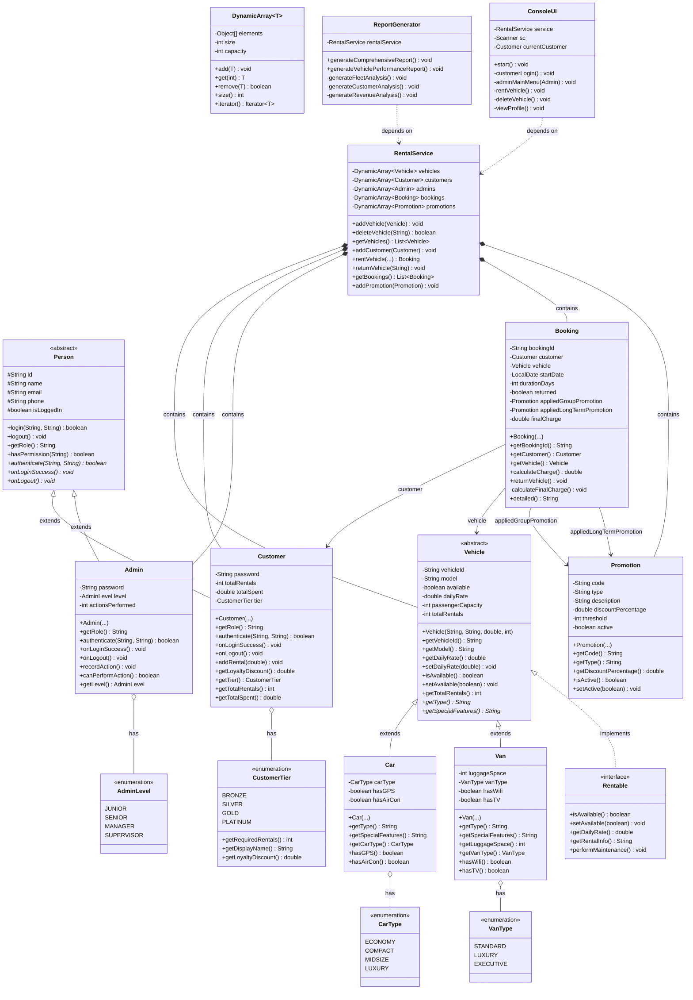

```mermaid
classDiagram
    %% Abstract classes and interfaces
    class Person {
        <<abstract>>
        #String id
        #String name
        #String email
        #String phone
        #boolean isLoggedIn
        +login(String, String) boolean
        +logout() void
        +getRole() String
        +hasPermission(String) boolean
        +authenticate(String, String)* boolean
        +onLoginSuccess()* void
        +onLogout()* void
    }

    class Rentable {
        <<interface>>
        +isAvailable() boolean
        +setAvailable(boolean) void
        +getDailyRate() double
        +getRentalInfo() String
        +performMaintenance() void
    }

    %% Vehicle hierarchy
    class Vehicle {
        <<abstract>>
        -String vehicleId
        -String model
        -boolean available
        -double dailyRate
        -int passengerCapacity
        -int totalRentals
        +Vehicle(String, String, double, int)
        +getVehicleId() String
        +getModel() String
        +getDailyRate() double
        +setDailyRate(double) void
        +isAvailable() boolean
        +setAvailable(boolean) void
        +getTotalRentals() int
        +getType()* String
        +getSpecialFeatures()* String
    }

    class Car {
        -CarType carType
        -boolean hasGPS
        -boolean hasAirCon
        +Car(...)
        +getType() String
        +getSpecialFeatures() String
        +getCarType() CarType
        +hasGPS() boolean
        +hasAirCon() boolean
    }

    class Van {
        -int luggageSpace
        -VanType vanType
        -boolean hasWifi
        -boolean hasTV
        +Van(...)
        +getType() String
        +getSpecialFeatures() String
        +getLuggageSpace() int
        +getVanType() VanType
        +hasWifi() boolean
        +hasTV() boolean
    }

    %% Person hierarchy
    class Customer {
        -String password
        -int totalRentals
        -double totalSpent
        -CustomerTier tier
        +Customer(...)
        +getRole() String
        +authenticate(String, String) boolean
        +onLoginSuccess() void
        +onLogout() void
        +addRental(double) void
        +getLoyaltyDiscount() double
        +getTier() CustomerTier
        +getTotalRentals() int
        +getTotalSpent() double
    }

    class Admin {
        -String password
        -AdminLevel level
        -int actionsPerformed
        +Admin(...)
        +getRole() String
        +authenticate(String, String) boolean
        +onLoginSuccess() void
        +onLogout() void
        +recordAction() void
        +canPerformAction() boolean
        +getLevel() AdminLevel
    }

    %% Enumerations
    class CustomerTier {
        <<enumeration>>
        BRONZE
        SILVER
        GOLD
        PLATINUM
        +getRequiredRentals() int
        +getDisplayName() String
        +getLoyaltyDiscount() double
    }

    class AdminLevel {
        <<enumeration>>
        JUNIOR
        SENIOR
        MANAGER
        SUPERVISOR
    }

    class CarType {
        <<enumeration>>
        ECONOMY
        COMPACT
        MIDSIZE
        LUXURY
    }

    class VanType {
        <<enumeration>>
        STANDARD
        LUXURY
        EXECUTIVE
    }

    %% Core business classes
    class Booking {
        -String bookingId
        -Customer customer
        -Vehicle vehicle
        -LocalDate startDate
        -int durationDays
        -boolean returned
        -Promotion appliedGroupPromotion
        -Promotion appliedLongTermPromotion
        -double finalCharge
        +Booking(...)
        +getBookingId() String
        +getCustomer() Customer
        +getVehicle() Vehicle
        +calculateCharge() double
        +returnVehicle() void
        -calculateFinalCharge() void
        +detailed() String
    }

    class Promotion {
        -String code
        -String type
        -String description
        -double discountPercentage
        -int threshold
        -boolean active
        +Promotion(...)
        +getCode() String
        +getType() String
        +getDiscountPercentage() double
        +isActive() boolean
        +setActive(boolean) void
    }

    %% Service layer
    class RentalService {
        -DynamicArray~Vehicle~ vehicles
        -DynamicArray~Customer~ customers
        -DynamicArray~Admin~ admins
        -DynamicArray~Booking~ bookings
        -DynamicArray~Promotion~ promotions
        +addVehicle(Vehicle) void
        +deleteVehicle(String) boolean
        +getVehicles() List~Vehicle~
        +addCustomer(Customer) void
        +rentVehicle(...) Booking
        +returnVehicle(String) void
        +getBookings() List~Booking~
        +addPromotion(Promotion) void
    }

    class DynamicArray~T~ {
        -Object[] elements
        -int size
        -int capacity
        +add(T) void
        +get(int) T
        +remove(T) boolean
        +size() int
        +iterator() Iterator~T~
    }

    class ReportGenerator {
        -RentalService rentalService
        +generateComprehensiveReport() void
        +generateVehiclePerformanceReport() void
        -generateFleetAnalysis() void
        -generateCustomerAnalysis() void
        -generateRevenueAnalysis() void
    }

    class ConsoleUI {
        -RentalService service
        -Scanner sc
        -Customer currentCustomer
        +start() void
        -customerLogin() void
        -adminMainMenu(Admin) void
        -rentVehicle() void
        -deleteVehicle() void
        -viewProfile() void
    }

    %% Relationships - Using Standard UML Notation
    
    %% Inheritance (Extension) - <|--
    Person <|-- Customer : extends
    Person <|-- Admin : extends
    Vehicle <|-- Car : extends
    Vehicle <|-- Van : extends
    
    %% Interface Implementation - <|..
    Vehicle <|.. Rentable : implements

    %% Aggregation (part can exist independently) - o--
    Customer o-- CustomerTier : has
    Admin o-- AdminLevel : has
    Car o-- CarType : has
    Van o-- VanType : has

    %% Composition (part cannot exist without whole) - *--
    RentalService *-- Vehicle : contains
    RentalService *-- Customer : contains
    RentalService *-- Admin : contains
    RentalService *-- Booking : contains
    RentalService *-- Promotion : contains

    %% Association (uses/references) - -->
    Booking --> Customer : customer
    Booking --> Vehicle : vehicle
    Booking --> Promotion : appliedGroupPromotion
    Booking --> Promotion : appliedLongTermPromotion

    %% Dependency (weaker form) - ..>
    ReportGenerator ..> RentalService : depends on
    ConsoleUI ..> RentalService : depends on
```
